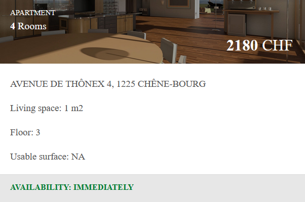

```{r include=FALSE}
knitr::opts_chunk$set(warning=FALSE, message=FALSE)
```

```{r echo=FALSE, message=FALSE, warning=FALSE}
# Activation of the different libraries needed for the project.
library(rvest)
library(dplyr)
library(tidyr)
library(lubridate)
library(purrr)
library(stringr)
library(readr)
library(ggplot2)
library(forcats)
library(infer)
library(tidygeocoder)
library(ggmap)
library(leaflet)
library(knitr)
library(magrittr)
```

# Introduction
This is the first report of a series of four reports. The goal of each report is to show my skills of

1. Accessing the data
2. Cleaning the data
3. Exploring the data
4. Analysing the data
5. Display any discovery in meaningful reports
6. Write a comprehensive report about the findings

In this report, we will take the data from a fake Real Estate website.
Then, we will explore it, putting an emphasis on some difficulties inherent of these kind of datasets.
Finally, we will display it on a map.
This report should be a good beginning to explore Real Estate data from a real dataset, in a real situation.

# The data

The first step was to actually browse the website to understand how it works.

Below, a screenshot of the webiste:
<center>
{width=95%}
</center>

While browsing the website, we see that the data is shown is a table view. The UI represents each item in a small cell of a bigger table.The entire data is in a unique page, which means there is no need to go to navigate more than this page.   
The data provided for the UI is the following:

* Type of item.
* Number of rooms
* Price
* Address
* area
* Floor
* Usable surface
* Availability time

But if we want to scrap this data, we cannot just copy-paste from the UI, we need to get the data from the source code directly. If we inspect the website code, we can see that there is no table, only `<div>` tags put altogether.
``` {eval=False}
<div class="col-sm">
	<div class="bg-sec-color">
		<div class="bg-sec" style="background-image: url('images/bg-sample6.png');">
			<div class="bg-text">
				<div class="object-type">Apartment</div>
				<div class="rooms">
					<strong>3</strong> Rooms
				</div>
				<div class="price">
					<span class="float-right"><strong>1900</strong> CHF</span>
				</div>
			</div>
		</div>
	</div>
	<div class="sec-info">
		<div class="address">
			<p>Rue de la Terrassière 58, 1207 Genève</p>
		</div>
		<div class="living-space">
			<p>Living space: <strong>63 m2</strong></p>
		</div>
		<div class="floor">
			<p>Floor: <strong>4</strong></p>
		</div>
		<div class="usable-surface">
			<p>Usable surface: <strong>NA</strong></p>
		</div>
	</div>
	<div class="availability sec-info2">
		<p>Availability: <strong>01 Oct 2018</strong></p>
		<p><a href="#"><span class="card-button float-right">See More</span></a></p>
	</div>
	...
</div>
```
Let's scrap the data and create a tibble with it.
Below, the code used to scrap the data is hidden to have a better comprehension of the report.
We only show a glimpse of the table to have a better snapshot of the data.
```{r}
# Read HTML page
rental_website <- read_html("https://epfl-exts.github.io/rental-scrape/")
# Create a list of all items.
list_items <- rental_website %>%
  html_elements(".col-sm")

# Now we can create 8 lists from each css tag.

location<- list_items %>%
  html_nodes(css = ".address") %>%
  html_text() %>%
  na_if('NA')

price<- list_items %>%
  html_nodes(css = ".price strong") %>%
  html_text() %>%
  na_if('NA')

currency <- list_items %>%
  html_nodes(css = ".price") %>%
  html_text() %>%
  na_if('NA')

object_type <- list_items %>%
  html_nodes(css = ".object-type") %>%
  html_text() %>%
  na_if('NA')

living_space <- list_items %>%
  html_nodes(css = ".living-space strong") %>%
  html_text() %>%
  na_if('NA')

floor <- list_items %>%
  html_nodes(css = ".floor strong") %>%
  html_text() %>%
  na_if('NA')

availability <- list_items %>%
  html_nodes(css = ".availability strong") %>%
  html_text() %>%
  na_if('NA')

usable_surface <- list_items %>%
  html_nodes(css = ".usable-surface strong") %>%
  html_text() %>%
  na_if('NA')

rooms <- list_items %>%
  html_nodes(css = ".rooms strong") %>%
  html_text() %>%
  na_if('NA')

# Put all together
appartments_df <- dplyr::bind_cols(
  location = location,
  price = price,
  currency = currency,
  object_type = object_type,
  rooms = rooms,
  living_space = living_space,
  floor = floor,
  availability = availability,
  usable_surface = usable_surface
)

glimpse(appartments_df)
```
We do have the 612 rows and 9 columns as expected by the sample data.
But, if we compare both, we see we have some with the data is not displayed exactly like the one in the sample.

```{r message=FALSE, warning=FALSE}
sample_data <- read_csv("sample_scraped_rental.csv")
glimpse(sample_data)
```

## Data cleaning
Let's explore each column one after another and clean it.

### Location column
The first column is the address of the rental good.
First. we check if we have any NA row in the column.
```{r}
appartments_df %>%
  select(location) %>%
  filter(is.na(location) == TRUE)
```
As expected, all the locations have some data inside. For now, we do not check the quality of such data, just if everything has something or not.

### Price column
Now we can focus on the price column.
Prices are discrete data and should be seen as numerics.
```{r}
appartments_df <- appartments_df %>%
  mutate_if(is.numeric,as.numeric)

appartments_df %>%
  head(5)
```
While checking the appartments_df, it seems that the price column is still a character column, not numeric. It means that not all rows have digits on them, but some may have other characters.

A quick check like the one below show us that some prices are, in fact not numbers.
```{r}
appartments_df %>%
  filter(str_detect(price, '\\D'))
```
These non numeric rows are a problem in the coherence of our data. It means that, if we need to do any calculation, we will need to remove these column to get only numbers.

### Currency column
Now let's focus on the currency column.
As we see the data is displayed in a strange way (\n\t \t\t\n\t \t\t1900 CHF\n \t\t)
```{r}
appartments_df %>%
  select(currency) %>%
  head(5)
```
We found that the easiest way it to extract the currency, as there are only two different possibilities for the data CHF or NA.

```{r}
appartments_df <- appartments_df %>%
  mutate(currency = str_extract(currency, regex("CHF|NA"))) %>%
  mutate(currency = na_if(currency, "NA"))

appartments_df
```
This column was easy to clean as it was to deal with the characters inside the string.

### Floor column
We also need to change the floor column. For now we only have a number, but in the sample csv file, we see that it is a awaiting for a string.
Instead of 4, I should see 4. Floor.
```{r}
appartments_df <- appartments_df %>%
  mutate(floor =  paste(floor, ". Floor", sep = "")) %>%
  mutate(floor = na_if(floor, 'NA. Floor')) %>%
  mutate(floor = str_replace(floor, "Underground. Floor", "Underground"))

appartments_df
```

### Availability column
Finally, we can take care of the last column that is not made of strings.
First we only tried to change the strings to date with the as.Date function and the correct format.
We got an error and then returned to inspect the column.
Note that I had issue with the conversion from string to Date because of the language of my computer.
I had to use Sys.setlocale("LC_TIME", "English") in the console to convert to English.

For now, the best solution is to keep both the string and the dates. 
The solution below was the most elegant we found.
```{r}
appartments_df <- appartments_df %>%
  mutate( availability = if_else(
      availability == "Immediately", 
      "Immediately",
      as.character(as.Date(availability, format="%d %b %Y"))
    )
  )

appartments_df
```

Finally, the table looks like the sample.
An important note here is on the datatype of each column. In fact, each column is a string because there is always a value that impeach the column to be another data type.

To finalise the cleaning, let's check the ranges of the numerical variables. Even if we said right before there is no numeric variable, we can consider price, rooms and area as numerical variables, after some changes.

First, let's get the range of prices:
```{r}
appartments_df %>%
  select(price, currency) %>%
  filter(price != "Price on request")%>%
  mutate(price = as.numeric(price)) %>%
  drop_na(price) %>%
  summarise(min_col =min(price),max_col =max(price))
```
We see that the price range is from 30 CHF to 22800 CHF.

As of the Exploratory exercise, it seems that we also should see the living space a numbers. The only thing that impeach us to do so is the unite written at the end. Let's see the range of the living space.
```{r}
appartments_df %>%
  select(living_space) %>%
  drop_na() %>%
  mutate(living_space = str_extract(living_space, regex("\\d+"))) %>%
  mutate(living_space = as.numeric(living_space)) %>%
  summarise(min_col =min(living_space),max_col =max(living_space))
```

The 1 $m^2$ surprised us, so we checked the data:
```{r}
appartments_df %>%
  filter(living_space == "1 m2")
```
We also found it in the UI:
<center>
{width=50%}
</center>
This is an anomaly in the data and should be filtered out during the analysis of the data.

Finally, we can also explore the range of rooms.
```{r}
appartments_df %>%
  select(rooms) %>%
  mutate(rooms = as.numeric(rooms)) %>%
  drop_na() %>%
  summarise(min_col = min(rooms), max_col = max(rooms))
```
So, we have items from 1 room to 13 rooms.
In the opposite of the area, it is very likely the Real Estate company suggest 1 room apartments, like studios.
We cannot deduct anything from these min/max, only we can be prepared to see a big diversity in the data from a studio to a big family house.

# Exploration

## Price vs Living space
The first question to ask ourselves while looking for an apartment is about the price over the area.
Let's build a scatter plot that shows the relation between these two numeric values.

```{r}
appartments_df_with_int <- appartments_df %>%
  select(price, living_space, object_type) %>%
  filter(price != "Price on request")%>%
  mutate(living_space = str_extract(living_space, regex("\\d+"))) %>%
  mutate(price = as.numeric(price)) %>%
  drop_na() %>%
  mutate(living_space = as.numeric(living_space))

interesting_objects <- appartments_df_with_int %>%
  select(price, living_space, object_type) %>%
  filter(price != "Price on request")%>%
  mutate(living_space = str_extract(living_space, regex("\\d+"))) %>%
  mutate(price = as.numeric(price)) %>%
  drop_na() %>%
  mutate(living_space = as.numeric(living_space))%>%
  filter(object_type %in% c("Hobby room", "Apartment", "Studio", "Villa", "Duplex"))

appartments_df_with_int %>%
  ggplot(mapping = aes(x = living_space,
                     y = price))+
  geom_point() +
  geom_point(data = interesting_objects,
             aes(x = living_space,
                     y = price,
                     color=object_type))+
  geom_smooth(method=lm, se=FALSE) +
  labs(title="Relationship between prices and living space",
       caption="Data from https://epfl-exts.github.io/rental-scrape",
       x="Area in m2", 
       y="Price in CHF",
       color = "Type of object")
```

We added to the plot colours to get the type of object to rent, and a regression line to show the correlation between the area and the price. 
About the colours, we chose to show the 5 most relevant objects type, the black dots are all the other kind of objects. We made this choice to avoid too much noise.
We can see that there is a positive relationship between the living space and prices. It means that more living space is given and more expensive the rental is.
The relationship is quiet linear, we have a few exceptions, like the 1$m^2$ which costs 2180 and is easily visible.

We also can see a small dispersion in the most common data (between ~>10$m^2$ to ~120$m^2$), then it seems to be way more dispersed. there is also less data after 200$m^2$.
We can arrive to such a conclusion that, indeed, there is a big probability that bigger the living space, more expensive it is, but this rule seems to be less rigid in bigger spaces (more than 200$m^2$).
Adding a third variable as the type of object, we can also see that the Hobby room objects are smaller (even if one is bigger than studios and apartments) and they are way cheaper than the other objects, which may influence the regression line.

Finally, we see that the biggest item is also the most expensive, which confirms the trend analysis we do. We can also be surprised to see that the most expensive item is not a villa or an individual house, but an apartment.

## Properties by postcode
The second question about Real Estate items is the location.
Now that we an idea of the price per surface area, we can also get an insight of the presence of the agency.
Let's build now a bar plot showing the number of properties by postcode.
```{r fig.height=10}
appartments_df %>%
  select(location) %>%
  mutate(code = str_extract(location, regex("\\d{4}"))) %>%
  group_by(code) %>%
  summarise(n_of_properties = n()) %>%
  ungroup %>%
  arrange(desc(n_of_properties)) %>%
  ggplot(aes(x = fct_reorder(code, n_of_properties), y = n_of_properties)) +
  geom_col(width = 0.7) +
  coord_flip()+
  #scale_x_discrete(guide = guide_axis(n.dodge=3))
  #guides(x = guide_axis(angle = 90)) +
  labs(
    title="Number of properties per postal code",
    caption="Data from https://epfl-exts.github.io/rental-scrape",
    x="Postal code",
    y="Number of properties"
    )
```

We can see that the agency is more active in the area of 1206 and 1205.
These are two residential district in Geneva. These district are known to be high-class districts.
1205 Genève is known as Plainpalais, it's a district close to the centre of Geneva and known for his cultural activity.
1206 Genève, is known as Champel, it's a very high-class and luxurious district.

Now we see that some districts are well represented.
Let's have a plot that shows the prices per area, separated per districts.

```{r}
price_sur_loc_fl <- appartments_df %>%
  select(price, living_space,location,floor) %>%
  filter(price != "Price on request")%>%
  mutate(living_space = str_extract(living_space, regex("\\d+"))) %>%
  mutate(price = as.numeric(price)) %>%
  drop_na() %>%
  mutate(living_space = as.numeric(living_space)) %>%
  mutate(code = str_extract(location, regex("\\d{4}"))) %>%
  mutate(floor = str_replace(floor, "Underground", "0")) %>%
  mutate(floor = str_extract(floor, regex("\\d+"))) %>%
  mutate(floor = as.numeric(floor)) %>%
  filter(between(floor, 0, 6)) %>%
  group_by(code) %>%
  filter(n()>10)

price_sur_loc_fl %>%
  ggplot(mapping = aes(x = living_space,
                     y = price,
                     color=floor))+
  geom_point() + 
  facet_wrap(vars(code))+
  labs(
    title="Price of flats over living space",
    subtitle = "Separated by postal code using facets and color for floors",
    caption="Data from https://epfl-exts.github.io/rental-scrape",
    x="Area in m2",
    y="Price in CHF",
    color = "Floor"
    )
```

For this plot, we made a choice, we wanted to show only the districts with more than 10 items, to make the plot more visible.
We see that all the districts follow the same logic, bigger the area, more expensive the item.Nonetheless, the district 1204 and 1218 seem to flatten at 200$m^2$. Also, comparatively, it seems that the district 1233 has a more horizontal dispersion, meaning the prices grown less accordingly to the surface area.
To continue the analysis, we see that the district 1205, for example, no area exceeds 150$m^2$. We can also see that the district 1206, which is the most represented has a wide variety of apartments and it seems distributed in the diagonal of perfect correlation between area and price.

We can also switch the colour with the facets.
```{r}
price_sur_loc_fl %>%
  ggplot(mapping = aes(x = living_space,
                     y = price,
                     color=code))+
  geom_point() + 
  facet_wrap(vars(floor))+
  labs(
    title="Price of flats over living space",
    subtitle = "Separated by floor using facets and color for district",
    caption="Data from https://epfl-exts.github.io/rental-scrape",
    x="Area in m2",
    y="Price in CHF",
    color = "District"
    )
```

Having a grid by floor permits to see that they also follow the same diagonal, bigger the area, bigger the price. This plot is a bit more complicate to interpret as there is a wide range of colours and it seems difficult to get any kind of conclusion.
The two only insights we can give are the following: 

* It seems that the price of first and fourth floor apartments tend to flatten at 200$m^2$.
* The data for the third floor is difficult to analyse as there are items from district 1201 and 1202 that are way more expensive than the others.

```{r echo=FALSE}
mean_expensive <- price_sur_loc_fl %>%
  group_by(code) %>%
  reframe(code, most_exp = max(price), least_exp = min(price), mean_exp = round(mean(price),2)) %>%
  distinct(code, .keep_all = TRUE) %>%
  arrange(mean_exp)
```
The least expensive postal code according to the meaning of all the data we have is `r mean_expensive%>%arrange(mean_exp)%>%head(1)%>%select(code)%>%magrittr::extract2("code")` with a mean price of `r mean_expensive%>%arrange(mean_exp)%>%head(1)%>%select(mean_exp)%>%mutate(mean_exp=as.character(mean_exp))%>%magrittr::extract2("mean_exp")`CHF.

The most expensive postal code according to the meaning of all the data we have is `r mean_expensive%>%arrange(desc(mean_exp))%>%head(1)%>%select(code)%>%magrittr::extract2("code")` with a mean price of `r mean_expensive%>%arrange(desc(mean_exp))%>%head(1)%>%select(mean_exp)%>%mutate(mean_exp=as.character(mean_exp))%>%magrittr::extract2("mean_exp")` CHF.

# Analysis

## Visible addresses vs addresses on demand
We explored the data, and got some conclusions. Now we will do some analysis in the data.
Our analysis will focus on two types of addresses display.

* <i>available</i> addresses
* <i>on request</i> addresses

The available addresses represent the addresses that are directly shown in the data. It is easy to put them on map.
The <i>on request</i> addresses only permit us to know the district, but not more. Note that the website represents English and French data, so we will need to search for addresses on request, and <i>sur demande</i>.


```{r}
on_demand_address <- appartments_df %>%
  filter(price != "Price on request")%>%
  mutate(living_space = str_extract(living_space, regex("\\d+"))) %>%
  drop_na(living_space) %>%
  mutate(price = as.numeric(price)) %>%
  mutate(living_space = as.numeric(living_space)) %>%
  mutate(on_request = str_extract(location, regex("Address on request|Sur demande"))) %>%
  mutate(on_request = str_detect(on_request, regex("Address on request|Sur demande"))) %>%
  mutate(floor = str_replace(floor, "Underground", "0")) %>%
  mutate(floor = str_extract(floor, regex("\\d+"))) %>%
  mutate(floor = as.numeric(floor)) %>%
  mutate(price_per_square_meter = price/living_space) %>%
  mutate(on_request = ifelse(on_request,'on request','available')) %>%
  mutate(on_request = replace_na(on_request,'available')) %>%
  # We filter out some extreme data
  filter(living_space>1)%>%
  filter(price_per_square_meter<75) %>%
  filter(price_per_square_meter>10)

```

Our interest focuses on price. Is there a price difference between <i>available</i> addresses and <i>on request</i> addresses ?

```{r}
on_demand_address %>%
  ggplot(aes(x=on_request, y=price)) +
  geom_violin(fill="gray")+
  geom_boxplot(width=0.1) +
  labs(
    title="Comparison of price trends between on demand addresses and written ones.",
    caption="The red dot represents the mean value.
    Data from https://epfl-exts.github.io/rental-scrape",
    x="Status of the address",
    y="Price in CHF"
    )+
  stat_summary(fun="mean", colour = "red", size = 0.25)
```

The 2 violin are pretty different. Let's analyse them one by one, then conclude.

Both plots represent a distribution of items based on their price and if their address is available on the agency website or not.

The first plot represents the <i>available</i> addresses. We see that the median and the mean values are quite close, as the big majority of prices are a bit under 2500 CHF.
If the mean is not superposed to the median it is mostly because of some extreme values that make the mean bigger than the median.
Speaking about extreme values, if we compare these with the <i>on request</i> addresses, we see that they are less present, but bigger.

The second plot represents <i>on request</i> addresses.
The mean and the median are very close, but not totally superposed. This means that the distribution is better distributed around the mean, but not totally. In fact, some extreme values make the mean bigger than the median.

We can conclude that if we search to rent an item, we have bigger chances to get a cheaper one if looking only at available addresses, but that the prices are more similar in the unshown addresses.

We can also compare the surface between on demand addresses and written addresses.
Let's plot it in a violin plot which permits to have a better understanding of the number of items.

```{r}
on_demand_address %>%
  # Basic violin plot
  ggplot(aes(x=on_request, y=living_space)) + 
  geom_violin(fill="gray")+
  geom_boxplot(width=0.1) +
  labs(
    title="Comparison of surface trends between on demand addresses and written ones.",
    caption="The red dot represents the mean value.
    Data from https://epfl-exts.github.io/rental-scrape",
    x="Status of the address",
    y="area"
    )+
  stat_summary(fun="mean", colour = "red", size = 0.25)
```

Again, the 2 violin charts are very different. Let's analyse them one by one, then conclude.

The first plot represents the distribution of available apartments based on their area.
We see that the median is close to 100$m^2$ with a majority of apartments a bit below this value.
In the opposite, the mean value is higher, as there are some extreme values with more than 500$m^2$ of area.

The second violin plot shows the distribution of <i> on request </i> addresses.
The median and the mean re superposed, which means that the data is equally distributed around it mean. In fact, we see that the majority of items is at mean / average value.
Also, the mean / median value are closer to 200$m^2$ than 100$m^2$.
The maximum values are also less extreme than the ones at the <i>available</i> addresses.

To conclude we can deduct that we have more chances to have a bigger item if we go to one without its addresses showed in the agency website.

The violin charts show a lot of data, but it is more secure having a table summarising group size, median, average, standard-deviation, minimum and maximum of the variable *price per square-meter* (expressed in CHF/$m^2$), by address status (on request or available).

```{r}
on_demand_address_stats <- on_demand_address %>%
  mutate(price_per_square_meter = price/living_space) %>%
  group_by(on_request) %>%
  summarise(
    group_size = n(),
    median = median(price_per_square_meter),
    average = mean(price_per_square_meter),
    standard_deviation = sd(price_per_square_meter),
    minimum = min(price_per_square_meter),
    maximum = max(price_per_square_meter)
  )
```

```{r}
on_demand_address_stats
```
Let's analyse this table column by column. First, the group size column is already interesting. It shows that 25% of the overall data has no location, but has to be requested. 

Then, if we compare both medians, we see that the numbers are very close. It means that for both there are 50% of locations cheaper than 33CHF/$m^2$ and 50% of location more expensive. 

The "average" column precises the distinction between the <i>on request</i> and the available addresses. In fact, the average of price per $m^2$ for the on request location is very close from the median which permits to already predict a small distribution. On the opposite, the bigger average in the available addresses shows that an extreme value is pushing the numbers up.

This distribution difference is even better pictured by the standard deviation column. In fact, closer the standard deviation is from 0 and smaller the distribution is. We see that the standard deviation with a value of 110 shows a big dispersion of the data. We also need to recall that the <i>available addresses</i> are represented 3 times more, than the <i>on request</i>.

Finally, the minimal and maximal value kind of confirm our assumptions. We see that the maximum value in the on demand locations is ~ 4 times bigger than the minimum, but that there should not be a  lot of these values. On the opposite, in the available locations row, we that the minimum and maximum are very different and we can expect a dataset with a big spread.

We can also show this data in a histogram chart.
```{r}
on_demand_address %>%
  ggplot(mapping = aes(x = price_per_square_meter, fill = on_request)) +
  geom_histogram() +
  labs(
    title="Distribution of number of items per price per square meter",
    caption="Data from https://epfl-exts.github.io/rental-scrape",
    x="Count of apartments",
    y="Price per square meter in CHF"
  )

```

We are happy to get a shape close to the Bayesian bell, which means the data is well enough distributed inside each group. But, if we compare the groups, we have the confirmation that there are a lot more <i>available</i> addresses than <i>on request</i>.

To challenge this dsitribution, we can go for a null hypothesis where the question would be: Both on request and available locations have the same mean price/$m^2$.

Here is the t-test
```{r}
t_test_pm <-  on_demand_address %>%
  t_test(price_per_square_meter ~ on_request,
         order = c("on request", "available"))

t_test_pm
```

Let's analyse it column by column.

The first column, called statistic is the measure of the difference between the two means. Here the statistic is very small, which means the two means are very close.

The p_value indicates the probability of observing the data under the null hypothesis. Here, the null hypothesis is 0.98, which is quite high. It means that there is insufficient evidence to reject the null hypothesis.

Let's do the same with the variable price only.
Here, the null hypothesis would be: Both <i>available</i> addresses and <i>on request</i> addresses have the same mean price.
```{r}
on_demand_address %>%
  group_by(on_request) %>%
  summarise(
    group_size = n(),
    median = median(price),
    average = mean(price),
    standard_deviation = sd(price),
    minimum = min(price),
    maximum = max(price)
  )
```
We already saw the difference between the median and the average on part 5. This table only confirms this. On average, the on request addresses are more expensive. We also see that both have huge standard deviation, which means that the data is spear far from the median. We have such confirmation by seeing both minimum and maximum data.

```{r}
t_test_p <-  on_demand_address %>%
  t_test(price ~ on_request,
         order = c("on request", "available"))

t_test_p
```

Let's analyse some columns.
The statistic column shows a difference between the means of the two groups. This difference is higher than the preivous one. It means that the difference between the mean of the price of the two groups is higher than the difference between the means of the price per square meter.

Most important, the p_value here is close to 0, which means there is a strong evidence against the null hypothesis.

## Mapping the some addresses
Finally, we will convert a subset of addresses and put it in a map.

```{r}
geo_localisation <- on_demand_address %>%
  filter(on_request == "available") %>%
  head(30)

geo_localisation <- geo_localisation %>%
  tidygeocoder::geocode(location, method = 'osm', lat = latitude , long = longitude) %>%
  select(location, latitude, longitude)


register_stadiamaps("5f54e0a3-5721-407e-b249-a9a9d700d82e", write=FALSE)
stadiamaps_key()
has_stadiamaps_key()

geo_localisation %>%
  leaflet() %>% 
  addTiles() %>% 
  addMarkers(lng=~longitude,lat=~latitude,
             label=~as.character(location),
             popup=~location)
```

# Conclusion
In this report, we went through the process of accessing, cleaning, exploring, and analysing real estate data obtained from a fake real estate website. We started by scraping the data from the website and then cleaned it to prepare it for analysis. During the exploration phase, we visualized the relationships between different variables such as price and living space, and we also examined the distribution of properties across postal codes.

Overall, this report provides valuable insights into the real estate market based on the data obtained from the website. It demonstrates the importance of thorough data cleaning and exploration before conducting any analysis, and it highlights the potential differences in property prices based on address availability.

# Sources
## Help for coding
https://ggplot2.tidyverse.org/index.html
http://www.sthda.com/english/wiki/ggplot2-scatter-plots-quick-start-guide-r-software-and-data-visualization
http://www.sthda.com/english/wiki/ggplot2-violin-plot-quick-start-guide-r-software-and-data-visualization
http://www.sthda.com/english/wiki/ggplot2-histogram-plot-quick-start-guide-r-software-and-data-visualization
https://www.wallstreetmojo.com/regression-line/
https://stackoverflow.com/questions/50995267/extract-value-from-tibble-in-r-markdown-inline-code


## Help for analysis
https://fr.wikipedia.org/wiki/Champel
https://fr.wikipedia.org/wiki/Plainpalais
