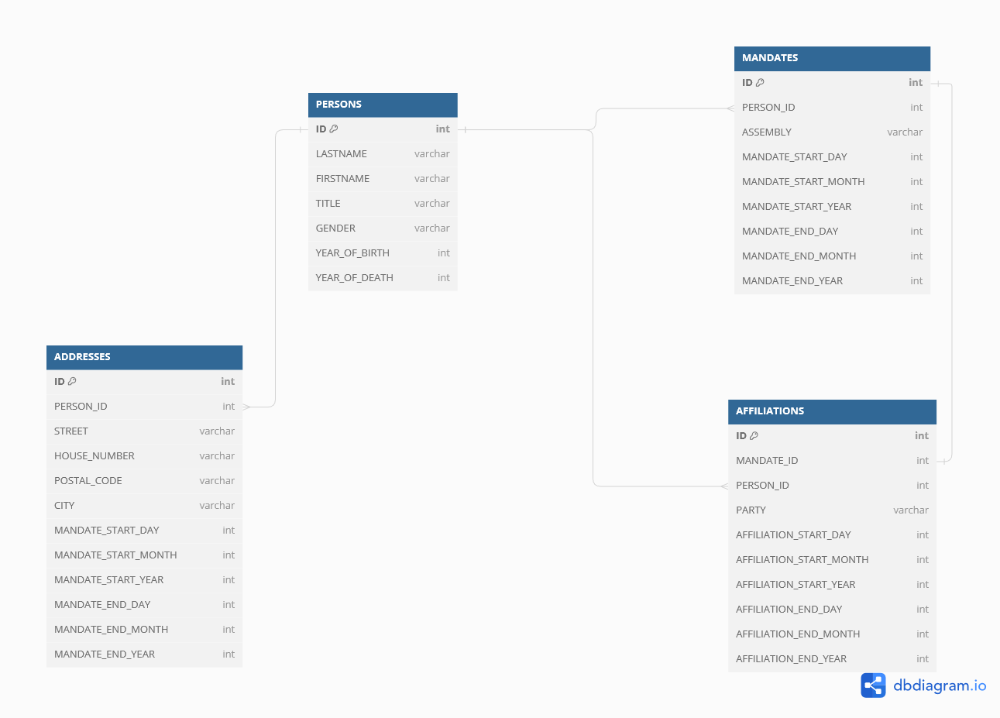

```{r setup, include=FALSE}
knitr::opts_chunk$set(warning=FALSE, message=FALSE)
```

```{r message=FALSE, warning=FALSE, echo=FALSE}
library(DBI)
library(tibble)
library(dplyr)
library(tidyr)
library(glue)
library(purrr)
library(lubridate)
library(stringr)
library(ggplot2)
library(scales)
library(infer)
library(tidygeocoder)
library(ggmap)
library(leaflet)
library(RSQLite)
```

# Introduction

This is the second report of the series of four reports. 

In this report, we will take the data from an `SQLite` database.
The database contains information about elected politicians in the canton of Zürich.
The instructions indicate that the data is messy and the data cleaning work is important.
After a first cleaning, we will analyse the dataset and get as most as possible from what he can give.
Finally, we will display some addresses on a map.
This report should be a good example of how to deal with dirty data, with columns not meaningful if let alone, NA values and indeed some wrong data.

In this work, we will do our best to get meaningful analytics and. even if there is a cleaning work, we will try to return the data as close as possible from the database.

# The data
The first step was to browse a bit the SQLite database to have a first snapshot of the data.
The exercise was quickly done and was not very interesting, so we will directly jump on its exploration through R script.

```{r echo=FALSE}
# Connect to the database
pol_zh_database <- dbConnect(RSQLite::SQLite(), "zh_politicians.db")

persons <- tbl(pol_zh_database, "PERSONS")
mandates <- tbl(pol_zh_database, "MANDATES")
addresses <- tbl(pol_zh_database, "ADDRESSES")
affiliations <- tbl(pol_zh_database, "AFFILIATIONS")

```

The database is divided in 4 different tables, each table having their columns.
We will now show a slimpse of each table and already have some comments about columns that need that.

```{r}
glimpse(persons)
```

* The table PERSONS
  Each row represents a person
  * ID: THe unique ID of a row
  * LASTNAME
  * FIRSTNAME
  * TITLE: We should expect to see some NAs on this column.
  * GENDER
  * YEAR_OF_BIRTH
  * YEAR_OF_DEATH: It is remarkable to note that this column may contain lots(?) of NA values.
  * ACTIVITY: The activity is written in German. We won't use this column at all.

```{r}
glimpse(mandates)
```

* The table MANDATES
  This table contains information about the mandates of the PERSONS.
  Each row represents a mandate from its beginning to its end.
  * ID
  * PERSON_ID: It permits to link a mandate with a PERSON. We should expect a 1 to many relationship.
  * ASSEMBLY
  * MANDATE_START_DAY
  * MANDATE_START_MONTH
  * MANDATE_START_YEAR
  * MANDATE_END_DAY
  * MANDATE_END_MONTH
  * MANDATE_END_YEAR
  Note that we will need to transform the DAY - MONTH - YEAR columns to something more usable as a proper date.
  
```{r}
glimpse(addresses)
```
* The table ADDRESSES
  This table represents the addresses registered by the PERSONS, when they had a mandate on.
  Each row is an address
  * ID
  * PERSON_ID: As for mandates, we should expect a 1 to many relationship.
  * STREET
  * HOUSE_NUMBER
  * POSTAL_CODE
  * CITY
  * MANDATE_START_DAY
  * MANDATE_START_MONTH
  * MANDATE_START_YEAR
  * MANDATE_END_DAY
  * MANDATE_END_MONTH
  * MANDATE_END_YEAR
  Like for the MANDATES table, we will need to aggregate some columns together to have a more usable data.
  Also, note that we might find a lot of NAs in the information about the address.
  

```{r}
glimpse(affiliations)
```
* The table AFFILIATIONS
  This table focuses on the party affiliation of each user.
  This table is linked to a PERSON and to a MANDATE
  We can expect a 1 to many relationship with PERSONS and a 1 to 1 with MANDATES.
  * ID
  * MANDATE_ID
  * PERSON_ID
  * PARTY
  * AFFILIATION_START_DAY
  * AFFILIATION_START_MONTH
  * AFFILIATION_START_YEAR
  * AFFILIATION_END_DAY
  * AFFILIATION_END_MONTH
  * AFFILIATION_END_YEAR

Here is a suggestion of the data scheme built with dbdiagram.io

<center>
{width=95%}

</center>

## Data cleaning
The first observations we have are the big number of int columns.
They are here to separate days from months from years.The first cleaning task will be to transform these columns into dates.
Let's do such cleaning one by one, beginning with the MANDATES table.

```{r}
dates_col <- c("start_year","start_month","start_day","end_year","end_month","end_day")

# Add leading 0 to months and days
add_leading_0 <- function(date_col){
   date_col = if_else(
    str_length(date_col)==1,
    paste0("0",date_col),
    date_col
  )
}

mandates_tibble <- mandates %>%
  rename_with(~ tolower(.x)) %>%
  rename_all(~stringr::str_replace(.,"^mandate_","")) %>%
  mutate(across(dates_col, as.character)) %>%
  collect()

mandates_tibble_clean <- mandates_tibble %>%
  # Add leading 0 to months and days
  mutate_at(vars(start_month,start_day,end_month,end_day),~add_leading_0(.)) %>%
  # Begin creation of date columns
  mutate(starting_date_mandate = paste0(start_year,'-',start_month,'-',start_day)) %>%
  mutate(ending_date_mandate = paste0(end_year, '-', end_month, '-', end_day)) %>%
  select(-dates_col) %>%
  mutate(id = as.character(id)) %>%
  mutate(person_id = as.character(person_id)) %>%
  mutate(starting_date_mandate = as.Date(starting_date_mandate, format="%Y-%m-%d")) %>%
  mutate(ending_date_mandate = as.Date(ending_date_mandate, format="%Y-%m-%d")) %>%
  rename(mandate_id = id) %>%
  distinct(mandate_id, .keep_all = TRUE)

glimpse(mandates_tibble_clean)
```

Now the mandates data is a bit cleaner. We have 5 columns, the mandate id, the person_id, the assembly, the starting date and the ending date.

Now, let's do the same for the 3 other tables.

```{r}
affiliations_tibble <- affiliations %>%
  rename_with(~ tolower(.x)) %>%
  rename_all(~stringr::str_replace(.,"^affiliation_","")) %>%
  mutate(across(dates_col, as.character)) %>%
  collect()

affiliations_tibble_clean <- affiliations_tibble %>%
  mutate_at(vars(start_month,start_day,end_month,end_day),~add_leading_0(.)) %>%
  mutate(starting_date_affiliation = paste0(start_year,'-',start_month,'-',start_day)) %>%
  mutate(ending_date_affiliation = paste0(end_year, '-', end_month, '-', end_day)) %>%
  #Remove useless columns
  select(-dates_col) %>%
  # Change int to str as IDs are nominal data
  mutate(id = as.character(id)) %>%
  rename(affiliation_id = id) %>%
  mutate(person_id = as.character(person_id)) %>%
  mutate(mandate_id = as.character(mandate_id)) %>%
  mutate(starting_date_affiliation = as.Date(starting_date_affiliation, format="%Y-%m-%d")) %>%
  mutate(ending_date_affiliation = as.Date(ending_date_affiliation, format="%Y-%m-%d")) %>%
  distinct(affiliation_id, .keep_all = TRUE)

glimpse(affiliations_tibble_clean)
```

Let's do the same for the addresses table.
It will be even easier as they use the same Mandate columns

```{r}
addresses_tibble <- addresses %>%
  rename_with(~ tolower(.x)) %>%
  rename_all(~stringr::str_replace(.,"^mandate_","")) %>%
  mutate(across(dates_col, as.character)) %>%
  collect()
  
addresses_tibble_clean <- addresses_tibble %>%
  mutate_at(vars(start_month,start_day,end_month,end_day),~add_leading_0(.)) %>%
  mutate(starting_date_mandate = paste0(start_year,'-',start_month,'-',start_day)) %>%
  mutate(ending_date_mandate = paste0(end_year, '-', end_month, '-', end_day)) %>%
  select(-dates_col) %>%
  rename(address_id = id) %>%
  mutate(address_id = as.character(address_id)) %>%
  mutate(person_id = as.character(person_id)) %>%
  # Columns as dates
  mutate(starting_date_mandate = as.Date(starting_date_mandate, format="%Y-%m-%d")) %>%
  mutate(ending_date_mandate = as.Date(ending_date_mandate, format="%Y-%m-%d")) %>%
  # Changing "" strings to NA
  mutate(street = na_if(street, "")) %>%
  mutate(house_number = na_if(house_number, "")) %>%
  mutate(postal_code = na_if(postal_code, "")) %>%
  mutate(city = na_if(city, "")) %>%
  unite(complete_address, street, house_number, sep = " ", remove = FALSE) %>%
  mutate(complete_address= na_if(complete_address, "NA NA")) %>%
  select(-c(
    street,
    house_number
  )) %>%
  unite(complete_address, complete_address, postal_code, sep = ", ", remove = FALSE) %>%
  mutate(complete_address= na_if(complete_address, "NA,NA")) %>%
  select(!postal_code) %>%
  mutate(complete_address = if_else(
    substring(complete_address, 1, 3) == "NA,",
    substring(complete_address, 4),
    complete_address
    )) %>%
  mutate(complete_address = str_remove(complete_address, regex("\\(([^)]+)\\)"))) %>%
  unite(complete_address, complete_address, city, sep = " ", remove = FALSE) %>%
  select(!city) %>%
  mutate(complete_address = str_remove(complete_address, regex(" NA "))) %>%
  distinct(address_id, .keep_all = TRUE)

glimpse(addresses_tibble_clean)
```

Finally, we can focus on the persons table

```{r}
persons_tibble <- persons %>%
  rename_with(~ tolower(.x)) %>%
  mutate(id = as.character(id)) %>%
  mutate(year_of_birth = as.character(year_of_birth)) %>%
  mutate(year_of_death = as.character(year_of_death)) %>%
  collect()

persons_tibble_clean <- persons_tibble %>%
  mutate(year_of_birth  = as.Date(year_of_birth , format="%Y")) %>%
  mutate(year_of_birth = year(year_of_birth)) %>%
  mutate(year_of_death  = as.Date(year_of_death , format="%Y")) %>%
  mutate(year_of_death = year(year_of_death)) %>%
  #Remove people with impossible ages
  mutate( age_at_death = if_else(
      is.na(year_of_death), 
      NA,
      year_of_death - year_of_birth)
  ) %>%
  filter(age_at_death < 120 | is.na(age_at_death)) %>%
  filter(age_at_death > 18  | is.na(age_at_death)) %>%
  select(-c(
    year_of_death,
    year_of_birth
  )) %>%
  filter(gender != "") %>%
  rename(person_id = id) %>%
  arrange(desc(age_at_death))

glimpse(persons_tibble_clean)

# We disconnect from the DB.
dbDisconnect(pol_zh_database)
```

The data is now cleaner. We have proper dates and addresses columns.

# Analysis

## Evolution of mandates

Now we have the 4 tibbles more or less cleaned. We can now explore the data.

Let's first have a look on the evolution of the mandates.

```{r}
mandates_tibble_clean %>%
  mutate(year = format(as.Date(starting_date_mandate, format="%Y-%m-%d"),"%Y")) %>%
  mutate(year = as.Date(year, format="%Y")) %>%
  group_by(year, assembly) %>%
  summarise(
    group_size = n(),
    ) %>%
  filter(
    assembly %in% c("Grand Council", "Cantonal Council") & group_size > 15 || 
      assembly %in% c("Executive Council", "Small Council")
    ) %>%
  ggplot(aes(x=year, y=group_size, group=assembly)) +
  geom_line(aes(color=assembly)) +
  labs(
    title="Number of active mandates each year",
    subtitle="The 'peaks' are caused by election years when multiple mandates were active for the same seat",
    x="Year",
    y="Number of mandates",
    color = "Assembly"
  )
```

Let's explain the plot and some choices made.
First, we made the choice to clean a bit the tibble by removing the years were there were less than 15 members for the Cantonal Council and the Executive Council.
This permits to have less peaks in the bottom and to be able to see the Executive Council and the Small Council lines.
This plot permits to see when the institutional change from Grand and Small Council to Cantonal and Executive Council was made.
It is also interesting to see that the rows are flatter at the end, maybe because the date is cleaner or less people has been elected over the years.

Let's now explore the gender dispersion in the different councils.

```{r}
person_mandates <- merge(x=mandates_tibble_clean,y=persons_tibble_clean, 
                by="person_id")
  
person_mandates %>%
  mutate(year = format(as.Date(starting_date_mandate, format="%Y-%m-%d"),"%Y")) %>%
  mutate(year = as.Date(year, format="%Y")) %>%
  group_by(year, assembly, gender) %>%
  summarise(
    group_size = n(),
    ) %>%
  ggplot(aes(x=year, y=group_size, group=gender)) +
  geom_line(aes(color=gender)) +
  facet_wrap(
    vars(assembly),
    scales = "free_x")+
  labs(
    title="Gender proportion in Zurich's Councils",
    x="Year",
    y="Number of mandates",
    color = "Gender"
  )

```

We can see that no women were mandated in the Grand and Small Council.
In 1900, at least 1 woman entered in the Cantonal Council. This data is a bit strange as women got the right to vote in Zurich the 15th of November 1970.

```{r}
person_mandates %>%
  mutate(year = format(as.Date(starting_date_mandate, format="%Y-%m-%d"),"%Y")) %>%
  mutate(year = as.Date(year, format="%Y")) %>%
  group_by(year, assembly, gender) %>%
  reframe(
    firstname,
    lastname,
    year,
    group_size = n()
    ) %>%
  filter(gender == "w")
```

Indeed, it seems that the "woman" from 1899 is a man and the data has been wrongly entered.
Let's correct it for the plot:
```{r}
person_mandates %>%
  mutate(year = format(as.Date(starting_date_mandate, format="%Y-%m-%d"),"%Y")) %>%
  mutate(year = as.Date(year, format="%Y")) %>%
  group_by(year, assembly, gender) %>%
  summarise(
    group_size = n(),
    ) %>%
  mutate(
    gender = ifelse(
      gender=="w" & year < 1970,
      "m",
      gender)) %>%
  ggplot(aes(x=year, y=group_size, group=gender)) +
  geom_line(aes(color=gender)) +
  facet_wrap(
    vars(assembly),
    scales = "free_x")+
  labs(
    title="Gender proportion in Zurich's Councils",
    x="Year",
    y="Number of mandates",
    color = "Gender"
  )
```

Now the data seems cleaner and we see that women are not well represented in politics, but their representation is growing enough to beat the 50% in the last years.

## Parties analysis

Let's analyse the party composition of the different councils.

```{r}
person_mandates_affiliations <-  merge(x=person_mandates,y=affiliations_tibble_clean, by="person_id")

person_mandates_affiliations %>%
  filter(ending_date_mandate > '2000-01-01' & starting_date_mandate < '2000-01-01') %>%
  distinct(person_id, .keep_all = TRUE) %>%
  select(
    !c(mandate_id.x,
       starting_date_mandate,
       ending_date_mandate,
       lastname,
       firstname,
       title,
       gender,
       activity,
       age_at_death,
       mandate_id.x,
       starting_date_affiliation,
       ending_date_affiliation)
  ) %>%
  mutate(
    total_parties = n_distinct(party)
    ) %>%
  
  # Get people per assembly
  group_by(assembly) %>%
  mutate(total_members = length(person_id)) %>%
  ungroup() %>%

  # Get number of participants per Party
  group_by(party, assembly) %>%
  mutate(party_participants = length(person_id)) %>%
  distinct(party, assembly, .keep_all = TRUE) %>%
  mutate(percentage_by_party = (party_participants/total_members)*100) %>%
  ungroup()%>%

  # Tag small parties from big parties
  mutate(tag = ifelse(
    percentage_by_party < 2,
    "Small Parties",
    party)) %>%
  
  ggplot(aes(fill=tag, y=percentage_by_party, x=assembly)) + 
    geom_bar(position="dodge", stat="identity") +
  labs(
    title="Party distribution in Zurch's chambers",
    y="Percentage of seats",
    x="Counsels",
    fill = "Parties"
  )

```

This plot shows us that 3 parties have a vast majority in the Cantonal Council, the SVP with 33%, the SP with 24% and the FPD with 20%.
These are the same parties represented in the Executive Council, but with the FPD representing 50% of it.

Let's now have a look upon time about the represented parties.

```{r}
person_mandates_affiliations %>%
  mutate(year = format(as.Date(starting_date_mandate, format="%Y-%m-%d"),"%Y")) %>%
  select(
    !c(mandate_id.x,
       starting_date_mandate,
       ending_date_mandate,
       lastname,
       firstname,
       title,
       gender,
       activity,
       age_at_death,
       mandate_id.y,
       starting_date_affiliation,
       ending_date_affiliation)
  ) %>%
  distinct(person_id, year, .keep_all = TRUE) %>%
  
  # Let's keep for now the persons without parties and give the party "No Party"
  #mutate(party = ifelse(
  #  party == "",
  #  "No party",
  #  party
  #)) %>%
  #filter(party != "")%>%
  filter(party %in% c("FDP", "SVP", "SP"))%>%
  
  group_by(year) %>%
  mutate(
    total_parties_by_year = n_distinct(party)
    ) %>%
  ungroup() %>%
  
  # Get people per assembly
  group_by(year, assembly) %>%
  mutate(total_members_per_year = length(person_id)) %>%
  ungroup() %>%

  # Get number of participants per Party
  group_by(year, party, assembly) %>%
  mutate(party_participants = length(person_id)) %>%
  distinct(party, assembly, .keep_all = TRUE) %>%
  mutate(percentage_by_party = (party_participants/total_members_per_year)*100) %>%
  ungroup()%>%

  # Tag small parties from big parties
  mutate(tag = ifelse(
    percentage_by_party < 2,
    "Small Parties",
    party)) %>%
  
  mutate(year = as.numeric(year))%>%
  
  filter(total_members_per_year > 15) %>%
  arrange(year) %>%
  
  #print(person_mandates_affiliations) %>%
  
  ggplot(aes(x=year, y=percentage_by_party, colour=tag)) + 
  geom_line() +
  facet_wrap(
    vars(assembly),
    scales = "free_x")

```

The 3 main political forces have a huge variation.
SVP is the party who comes from the bottom, who has a big variation, but was peak close before the years 200 and then 2010.
It then fell, but now it is progressing again.
The SP was represented by a bit more than 30% of the Cantonal Council, with some very bottom points were the party felt under the 20%, it seems stable between 30 and 45% of the assembly, with a peak at more than 50% by the 2010's.
Finally, the third party, the FDP was the most represented neat 1970 with more than 50% of representative.
It had a tendency to fell until 2010 where the party had less than 10% of its representatives.
From then it is rising again.

The last tendency are the SVP and FDP rising and the SP falling after its peak.

##Politicians analysis

Let's now study the lifespan of politicians.

```{r}
persons__title_test <- persons_tibble_clean %>%
  drop_na(age_at_death) %>%
  mutate(has_title = ifelse(
    title == "",
    "no",
    "yes"
  )) 

persons__title_test%>%
  ggplot(aes(x=has_title, y=age_at_death)) +
    geom_violin(fill="gray")+
    geom_boxplot(width=0.1) +
    labs(
      title="Comparison of lifespan between politicians with a title and without",
      caption="The red dot represents the mean value.",
      x="Does have a title",
      y="Age at death"
      )+
    stat_summary(fun="mean", colour = "red", size = 0.25)
```

This plot represents the distribution of ages between the representatives comparing if they do have a title or not.
We can see that the oldest person to die had no title, but the median and the mean ages are higher in the sample of people with a title.
The violin plot also permits to show us that most of people without a title died between 60 and 70, it younger than people with a title who died at 75, where the mean and average is too.
We can also say that the first quartile of people with a title arrives at the median of people without a title.
It means that where 25% people with a title died, already 50% of people without a title already died.

Let's confirm or not our plot analysis by doing a statistical test.

```{r}
persons__title_test %>%
  group_by(has_title) %>%
  summarise(
    group_size = n(),
    median = median(age_at_death),
    average = mean(age_at_death),
    standard_deviation = sd(age_at_death),
    minimum = min(age_at_death),
    maximum = max(age_at_death)
  )
```

Indeed, we are close to our plot analysis.
The statistical test shows us more information and more precise one.
The first difference is the group size.
Even if we could guess that there was more people without a title than with, the statistical test permits us to see the difference close close to the double of untitled people against titled.
The we see that the median and the average values are close to what we described.
and the standard deviation is also very similar, value-wise.
A thing we could observe with the boxplot, but did not spoke about during the analysis.

Let's also test the sample with the null hypothesis.
The null hypothesis question is: Do the people with a title and without die at the same age (in average)?

```{r}
t_test_per_ti <-  persons__title_test %>%
  t_test(age_at_death ~ has_title,
         order = c("yes", "no"))

t_test_per_ti
```

The p_value is very small, it indicates that the null hypothesis is very unlikely to be true. We also can see that the lower_ci shows that it is easier to identify the difference between both with or without title thant in the upper values.

Let's now differentiate people born before and after 1918.

```{r}
variable_names <- list(
  "yes_before_1918" = "Born before 1918" ,
  "no_after_1918" = "Born after 1918"
)


variable_labeller <- function(variable,value){
  return(variable_names[value])
}

person_title_1918 <- persons_tibble %>%
  mutate(year_of_birth  = as.Date(year_of_birth , format="%Y")) %>%
  mutate(year_of_birth = year(year_of_birth)) %>%
  mutate(year_of_death  = as.Date(year_of_death , format="%Y")) %>%
  mutate(year_of_death = year(year_of_death)) %>%
  #Remove people with impossible ages
  mutate( age_at_death = if_else(
      is.na(year_of_death), 
      NA,
      year_of_death - year_of_birth)
  ) %>%
  filter(age_at_death < 120 | is.na(age_at_death)) %>%
  filter(age_at_death > 20  | is.na(age_at_death)) %>%
  filter(gender != "") %>%
  drop_na(age_at_death) %>%
  mutate(has_title = ifelse(
    title == "",
    "no",
    "yes"
  )) %>%
  mutate(born_before_1918 = ifelse(
    year_of_birth <= 1918,
    "yes_before_1918",
    "no_after_1918"
  ))

person_title_1918 %>%
  ggplot(aes(x=has_title, y=age_at_death)) +
    geom_violin(fill="gray")+
    geom_boxplot(width=0.1) +
    facet_wrap(
      vars(born_before_1918),
      labeller=variable_labeller
    )+
    labs(
      title="Comparison of lifespan between politicians with a title and without",
      caption="The red dot represents the mean value.",
      x="Does have a title",
      y="Age at death",
      facet = "Born before 1918"
      )+
    stat_summary(fun="mean", colour = "red", size = 0.25)
```

It seems that the dates of birth makes a bigger difference than the titles.
We see that the median and average values in the population born after 1918 are far higher than the population born before.
Also, we can see that the population born before 1918 and without titles have an average lifespan and a median lifespan lower than the 3 other populations.

Let's also analyse it with its statistics table.

```{r}
person_title_1918 %>%
  group_by(born_before_1918, has_title) %>%
  summarise(
    group_size = n(),
    median = median(age_at_death),
    average = mean(age_at_death),
    standard_deviation = sd(age_at_death),
    minimum = min(age_at_death),
    maximum = max(age_at_death)
  )
```

The statistics confirm that people born before 1918 without a title are the biggest proportion.
The statistics also confirm that the people born before 1918 without a title die in average and median before the other groups.

HEre the null hypothesis is:

```{r}
t_test_per_before_1918 <-  person_title_1918 %>%
  filter(born_before_1918 == "yes_before_1918") %>%
    t_test(age_at_death ~ has_title,
         order = c("yes", "no")) %>%
  mutate(sample = "before 1918")

t_test_per_after_1918 <- person_title_1918 %>%
  filter(born_before_1918 == "no_after_1918") %>%
    t_test(age_at_death ~ has_title,
         order = c("yes", "no"))%>%
  mutate(sample = "after 1918")

t_test_per_before_1918 %>%
  add_row(t_test_per_after_1918)
```

Let's then compare both t_tests.
They are very different, but answer our question.
We see that before 1918, we can reject the null hypothesis with a strong conviction, but after 1918, we can't because the p_value is greater than 0.5. We can state that the data does not permit to recuse the null hypothesis for data after 1918.

```{r}
person_mandates %>%
  mutate(full_name = paste(firstname, lastname, sep = ' ')) %>%
  group_by(person_id)%>%
  reframe(
    nb_mandates = n(),
    full_name,
    person_id
  ) %>%
  arrange(desc(nb_mandates)) %>%
  distinct(person_id, .keep_all = TRUE) %>%
  drop_na() %>%
  head(10) %>%
  ggplot(aes(x=reorder(full_name, +nb_mandates), y=nb_mandates, fill=nb_mandates)) +
  coord_flip() +
  geom_bar(stat="identity") +
  labs(
      title="Persons with the biggest number of formats",
      x="Person",
      y="Number of mandates",
      )+
  guides(fill = "none")
```

Here is the top 10 of politicians with a mandate.

But here, we only see the total number, maybe some politicians had more than one mandate.

```{r}
person_mandates %>%
  mutate(full_name = paste(firstname, lastname, sep = ' ')) %>%
  group_by(full_name)%>%
  reframe(
    nb_mandates = n(),
    full_name,
    person_id
  ) %>%
  ungroup() %>%
  arrange(desc(nb_mandates)) %>%
  distinct(full_name, .keep_all = TRUE) %>%
  drop_na() %>%
  head(10) %>%
  ggplot(aes(x=reorder(full_name, +nb_mandates), y=nb_mandates, fill=nb_mandates)) +
  coord_flip() +
  geom_bar(stat="identity") +
  labs(
      title="Persons with the biggest number of mandates",
      x="Person",
      y="Number of mandates",
      )+
  guides(fill = "none")
```

We see that if we don't check by PERSON_ID, but by full name, the top 10 changes.
IT may mean two thing:

-   The person ID is different from a Council to another.
-   People can have the same first and last name and it is not possible to differentiate it.


Now, let's see who are the politicians with mandates in the same time.
We will count on the full name and not the person_id as we suspect the person_id to be unique by assembly.

```{r}
person_mandates %>%
  select(
    !c(
      person_id,
      mandate_id,
      )
  ) %>%
  mutate(full_name = paste(firstname, lastname, sep = ' ')) %>%
  select(
    !c(
      lastname,
      firstname,
      title,
      gender,
      activity,
      age_at_death
      )
  ) %>%
  #mutate(time_fork = interval(starting_date_mandate,ending_date_mandate)) %>%
  arrange(full_name, starting_date_mandate) %>%
  mutate(
    last_end_time = ifelse(
      full_name == lag(full_name),
      lag(ending_date_mandate),
      NA
      )
    ) %>%
  # Keep only rows where there is a previous mandate.
  drop_na(last_end_time) %>%
  mutate(last_end_time = as_date(last_end_time)) %>%
  mutate(cumulate = ifelse(
    starting_date_mandate < last_end_time,
    "yes",
    "no"
  )) %>%
  filter(cumulate == "yes") %>%
  group_by(full_name) %>%
  reframe(
    cumulated_mandates = n()+1
    ) %>%
  arrange(desc(cumulated_mandates)) %>%
  head(10) %>%
  ggplot(aes(x=reorder(full_name, +cumulated_mandates), y=cumulated_mandates, fill=cumulated_mandates)) +
  coord_flip() +
  geom_bar(stat="identity") +
  labs(
      title="Persons with the biggest number of cumulated mandates",
      subtitle= "This plot does not show if the mandates were all in the same time or not.",
      x="Person",
      y="Number of mandates",
      )+
  guides(fill = "none")
```

Heinrich Honegger had 6 cumulated mandates.
He did not have it in the same time, it only means that he had at least 2 mandates in the same time.

Let's see the politicians who changed their ranks.

```{r}
person_mandates_affiliations %>%
  select(!c(
    person_id,
    mandate_id.x,
    mandate_id.y,
    assembly,
    starting_date_mandate,
    ending_date_mandate
  )) %>%
  mutate(full_name = paste(firstname, lastname, sep = ' ')) %>%
  select(
    !c(
      lastname,
      firstname,
      activity,
      gender,
      title,
      age_at_death,
      )
  ) %>%
  mutate(party = na_if(party, "")) %>%
  drop_na(party) %>%
  drop_na(ending_date_affiliation) %>%
  group_by(full_name) %>%
  distinct(party, full_name) %>%
  reframe(
    number_parties = n()
  ) %>%
  arrange(desc(number_parties)) %>%
  head(10) %>%
  ggplot(aes(x=reorder(full_name, +number_parties), y=number_parties, fill=number_parties)) +
  coord_flip() +
  geom_bar(stat="identity") +
  labs(
      title="Persons with the biggest number of parties",
      x="Person",
      y="Number of parties",
      )+
  guides(fill = "none")
```

We see that there are not a big number of changes.

Finally, let's locate 20 of these politicians.

```{r echo=FALSE}
addresses_clean <-addresses_tibble %>%
  mutate(street = na_if(street, "")) %>%
  mutate(house_number = na_if(house_number, "")) %>%
  mutate(postal_code = na_if(postal_code, "")) %>%
  mutate(city = na_if(city, "")) %>%
  drop_na(street) %>%
  drop_na(house_number) %>%
  drop_na(postal_code) %>%
  drop_na(city) %>%
  unite(complete_address, street, house_number, sep = " ", remove = FALSE) %>%
  unite(complete_address, complete_address, postal_code, sep = ", ", remove = FALSE) %>%
  mutate(complete_address= na_if(complete_address, "NA,NA")) %>%
  mutate(complete_address = if_else(
    substring(complete_address, 1, 3) == "NA,",
    substring(complete_address, 4),
    complete_address
    )) %>%
  mutate(complete_address = str_remove(complete_address, regex("\\(([^)]+)\\)"))) %>%
  unite(complete_address, complete_address, city, sep = " ", remove = FALSE) %>%
  mutate(complete_address = str_remove(complete_address, regex("NA "))) %>%
  select(
    !c(
      street,
      house_number,
      postal_code,
      city
      )
  ) %>%
  head(20)


geo_localisation <- addresses_clean %>%
  tidygeocoder::geocode(complete_address, method = 'osm', lat = latitude , long = longitude) %>%
  select(complete_address, latitude, longitude)

register_stadiamaps("5f54e0a3-5721-407e-b249-a9a9d700d82e", write=FALSE)
stadiamaps_key()
has_stadiamaps_key()

geo_localisation %>%
  leaflet() %>% 
  addTiles() %>% 
  addMarkers(lng=~longitude,lat=~latitude,
             label=~as.character(complete_address),
             popup=~complete_address)
```

# Conclusion
In this report we embarked on a deep cleaning journey. The overview of the data was useful to understand its structure and be less scared by the number of int columns.

This cleaning process was crucial to ensure the usability of the data.

Our analysis did explore several aspects of the dataset, including the evolution of mandates over time, gender representation in councils, party composition, lifespan analysis of politicians, and identification of influential figures with multiple mandates.

This report shows us historical data. We could talk about the power of such visualizations in gender equality over the years. But we prefer to have a step back and say "it is just data". To complete our exploration and understanding of what phenomenas we are facing. We would need the help of specialists to get more quality insights on what we see.
Data sciences can show patterns, movements, nubmers, but, in this case, does not permit to fully udnerstand why we see that.
The best example is that the data does not tell us the difference between the Cantonal Council and the Grand Council and what are the causes that made one disappear and the other appear. 

# Sources
## Help for coding
https://rdrr.io/r/base/chartr.html

## Help for analysis
https://dbdiagram.io/home
https://fr.wikipedia.org/wiki/Suffrage_f%C3%A9minin_en_Suisse
