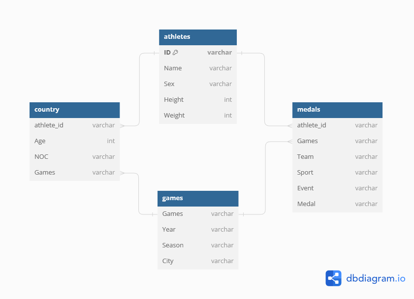

```{r message=FALSE, warning=FALSE, echo=FALSE}
library(readxl)
library(dplyr)
library(tidyr)
library(ggplot2)
library(forcats)
library(plotly)
library(viridis)
library(infer)
library(stringr)
library(magrittr)
```


# Introduction

This report is the fourth, and the last of the series of four reports.
On this report, we will analyse a pretty big dataset stored into an Excel sheet. The data is an historical report from the Olympic Games.
Along this report, we will try to get some fact about the Games.

# The data
```{r, echo=FALSE}
athletes_tibble <- read_xlsx("olympics.xlsx", sheet = "athletes") %>%
  mutate(ID = as.character(ID)) %>%
  rename(c(athlete_id=ID))
countries_tibble <- read_xlsx("olympics.xlsx", sheet = "country") %>%
  mutate(athlete_id = as.character(athlete_id))
games_tibble <- read_xlsx("olympics.xlsx", sheet = "games")
medals_tibble <- read_xlsx("olympics.xlsx", sheet = "medals") %>%
  mutate(athlete_id = as.character(athlete_id))
```

The data is in a big Excel file with 4 sheets.

```{r} 
glimpse(athletes_tibble)
```

The first sheet focuses on athletes and some of their characteristics.
Each row represents an athlete.
The columns are the following:

* athlete_id
* Name
* Sex
* Height
* Weight

```{r}
glimpse(countries_tibble)
```

The second sheet shows the athletes who participated to events, but based on their NOC and the Games.
If an athlete participated to two different Games, we should have two rows, one by Game.
As we see, the difference between the number of rows of this tibble and the athletes one is 51'881 rows, which means we have this amount of at least duplicates.

The columns are the following:
* athlete_id
* Age
* NOC
* Games

```{r}
glimpse(games_tibble)
```

The third sheet is also the smallest dataset focuses on the each Olympic Games characteristic.
Each row represents a iteration of the Olympic Games.

The columns are the following:
* Games
* Year
* Season
* City

```{r}
glimpse(medals_tibble)
```
The fourth sheet focuses on who won a medal. This dataset is the biggest one as there is 1 row per athlete, per event per Games. It means if 4 individuals won a Gold medal during an event, them the country will earn 4 medals.
This row has a lot of duplicate athletes.

The columns are the following:
* athlete_id
* Games
* Team
* Sport
* Event
* Medal

We can transcribe the relationship of each tibble by the following graph:

<center>
{width=95%}
</center>

The scheme shows us in a better way the relationship of each table. We have a 1 to many relationship between the athletes sheet and the country sheet. We have the same relationship type between the athletes sheet and the medals sheet.
Both country sheet and medals sheet have a many to 1 relationship with the games sheet.

## Analysis
Now we have a better overview of our data, we can focus on the analysis of the dataset.

### Athletes country analysis

The first focus will be on athletes.
As we saw a 1 to many relationship between athletes and country, we are in right position to ask if some athletes have competed for different countries over time?

```{r}
#Join athletes and country table
athletes_country <-  merge(x=athletes_tibble,y=countries_tibble, by="athlete_id")


athletes_country_numbers <- athletes_country %>%
  distinct(athlete_id, NOC, .keep_all = TRUE) %>%
  group_by(athlete_id) %>%
  summarise(countries = list(NOC)) %>%
  ungroup %>%
  mutate(nb_countries = lengths(countries)) %>%
  group_by(nb_countries) %>%
  summarise(nb_athletes_by_country = n()) %>%
  ungroup

filtered_athletes_country_numbers <- athletes_country_numbers %>%
  filter(nb_countries > 1) %>%
  summarise(more_1_country = sum(nb_athletes_by_country))

filtered_athletes_country_numbers

```
Yes, `r filtered_athletes_country_numbers%>%magrittr::extract2("more_1_country")` athletes have competed for 2 or more countries.

We can find more details in the plot below:

```{r}
athletes_country_numbers %>%
  ggplot(aes(x = fct_reorder(as.character(nb_countries), format(nb_athletes_by_country, scientific=F)), y = nb_athletes_by_country)) +
  geom_col(width = 0.7) +
  coord_flip()+
  labs(
    title="Number of athletes per number of coutries reprentation",
    x="Number of coutries represented by the an athlete",
    y="Number of athletes"
    )
```

The plot is difficult to analyse. We see that a very large number of athletes only competed for 1 country, but some have comepter for 2 and a small number for 3 or 4 different countries.
We recreated this plot, but by removing the scientific numerotation.

```{r}
athletes_country_numbers %>%
  ggplot(aes(x = fct_reorder(as.character(nb_countries), nb_athletes_by_country), y = format(nb_athletes_by_country, scientific=F))) +
  geom_col(width = 0.7) +
  coord_flip()+
  labs(
    title="Number of athletes per number of coutries reprentation",
    x="Number of coutries represented by the an athlete",
    y="Number of athletes"
    )
```

Now we can see all the rows, but their weight is not relative to each other any more. Even if the numbers are very precise, we see that 134001 athletes competed for 1 country, 1473 athletes competed for 2 countries, 92 athletes competed for 3 countries and 5 athletes competed for 4 countries, just looking at the bars does not give us such precision. In fact, only checking the bars seems to indicate that 2 times more athletes competed for 3 countries, compared to 4. But in reality, the bar of 4 countries should be 5% of the weight of the bar of 3 countries. This comparison of 2 plots show that even if the data shown by numbers is correct, we should always be careful with the visualisation. 

As we see, the big majority of athletes represented 1 country (a bit less than 99%), it can be interesting to completely ignore them and to zoom in the `r filtered_athletes_country_numbers%>%magrittr::extract2("more_1_country")` athletes who competed for more than one country.
We also decided to suggest another plot to show it.

```{r}
p <-athletes_country_numbers %>%
  filter(nb_countries > 1) %>%
  # prepare text for tooltip
  mutate(text = paste("Number of athletes in this group: ", nb_athletes_by_country)) %>%
  
  ggplot(aes(x = nb_countries, y = nb_athletes_by_country, text=text)) +
  geom_point(alpha=0.7) +
  scale_size(range = c(1.4, 10), name="Number of athletes") +
  scale_color_viridis(discrete=TRUE, guide=FALSE) +
  theme(legend.position="none")+
  labs(
    title="Number of athletes per number of coutries reprentation",
    x="Number of coutries represented by the an athlete",
    y="Number of athletes"
    )
  
# turn ggplot interactive with plotly
pp <- ggplotly(p, tooltip="text")
pp
```

#### Preliminar conclusion
This is expected that athletes compete for more than one country for various reasons:

* The athlete changed his country for personal reasons.
* The country does not exist any more (in the sources, we added a website with a list of countries that disappeared since World War 2).
* The country changed its name (We also added in the sources a list of countries that changed their name).
* Remember that we are not really talking about "countries" but about NOCs, in the case of Russia, after the Winter Games of 2018 in Pyeongchang, Russian athletes cannot represent Russia any more, but ROC (Russian Olympic Committee).
* Also the IOC code for the NOC can change, a scenario that can also appear in our data.
* The athlete competes for the EOR (European Refugee Team)

#### Further details
Let's take the example of the five athletes who represented 4 countries during the Olympic Games history:

```{r message=FALSE, warning=FALSE}
athletes_country %>%
  distinct(athlete_id, NOC, .keep_all = TRUE) %>%
  group_by(athlete_id) %>%
  reframe(Name, countries = list(NOC), list_games = list(Games)) %>%
  ungroup %>%
  distinct(Name, .keep_all = TRUE) %>%
  mutate(nb_countries = lengths(countries)) %>%
  filter(nb_countries == 4) %>%
  unnest(countries, list_games) %>%
  select(-c(athlete_id, nb_countries))
```

We can see that all of them were in at least a country that does not exist any more for their first Games.

### Particiaptions to Games
Now that we have the athletes and which country they represented, we can ask ourselves who are the ten athletes that took part in most games?

```{r}
athletes_country %>%
  group_by(athlete_id) %>%
  reframe(number_participation = n(), Name) %>%
  distinct(Name, .keep_all = TRUE) %>%
  arrange(desc(number_participation)) %>%
  head(12) %>%
  ungroup
```
It is difficult to give a top 10 as 9 athletes participated at 8 iterations of the games, 2 at 9 iterations and 1, Ian Millar at 10 iterations.

This is not very surprising as he's an equestrian and equestrian athletes are the ones who can have the longest career. The 2 other athletes with 8 participations are a shooter and a sailor, who also have long careers. 

Now we know who are the athletes who participated in most Games, let's see if they also are the ones who competed in the most events?
```{r}
athletes_medals <-  merge(x=athletes_tibble,y=medals_tibble, by="athlete_id")

athletes_medals %>%
  group_by(athlete_id) %>%
  reframe(events_per_games = n(), Name, Event) %>%
  distinct(Name, .keep_all = TRUE) %>%
  arrange(desc(events_per_games)) %>%
  head(10)
```
The athlete who competed in the biggest number of events is Robert Tait McKenzie with 58 participations in total.

We also check who is the athlete who participated in most event in only 1 Game.
```{r}
athletes_medals %>%
  group_by(athlete_id, Games) %>%
  reframe(events_per_games = n(), Name, Event) %>%
  distinct(Name, .keep_all = TRUE) %>%
  arrange(desc(events_per_games)) %>%
  head(10)
```
Acee Blue Eagle is the person who participated at the most events in one iteration of Olympic Game.

#### Preliminary conclusion

### Medals analysis
Now let's focus on countries and how many medals they won.

Let's create a new table showing the number of medals per country (rows) and per year (column).
Keep only the 15 countries with the most medals overall.

```{r}
athletes_medals_countries <- merge(x=athletes_medals,y=countries_tibble, by="athlete_id") %>%
  select(-Games.y) %>%
  rename(Games = Games.x)

top_15_countries <- athletes_medals_countries %>%
  drop_na(Medal) %>%
  group_by(NOC) %>%
  mutate(total_medals = n()) %>%
  ungroup() %>%
  arrange(desc(total_medals)) %>%
  distinct(NOC, pick(total_medals)) %>%
  head(15)

top_15_countries_vector <- top_15_countries$NOC

top_countries_games <- merge(x=top_15_countries,y=athletes_medals_countries, by="NOC")

top_countries_games %>%
  group_by(NOC, Games) %>%
  reframe(medal_by_envent = n(), total_medals) %>%
  ungroup() %>%
  arrange(desc(total_medals)) %>%
  distinct(total_medals,Games,NOC, .keep_all = TRUE) %>%
  pivot_wider(
    names_from = "Games",
    values_from = medal_by_envent
  )
  
```
This final table has very interesting data on it.
First, we can see that by far USA is the country with the biggest number of medals overall, with 9859 medals.
The top 3 is completed by Germany and URSS, which is the only country that does not exist any more now.

The story of URSS is very interesting. Indeed the Union of Soviet Socialist Republics was officially created in 1922 and disappeared end of 1991. So, this country was not able to compete in the first Olympic Games and in the the ones from 1992, but we see that it "earns" some medals after 1992, meaning an athlete who previously represented URSS still competed under another flag and hour data does not show us which flag. Without too much difficulty, we can say that the country inheriting from URSS is directly Russia who began to win a significant number of medals directly in 1992. Like the URSS, we can still see some athlete medals before its creation, it's due to some small issues in the way data is counted.
To show the USA supreme in sport, even URSS + Russia does 7392 medals, which means that USA is still ahead of 2467 medals in total.

Is there a relationship between country and the probability of winning a medal?

We know that some countries win more medals than others.
In this part we want to work out whether some countries win more medals simply because they have more athletes competing for more events, or whether their athletes are in fact performing better in general.

For this part, look only at the top 15 countries that you established in part 4.

- Create a horizontal barchart listing for each of the fifteen countries the percentage of medals won *out of all medals competed for by that country*. 

```{r}
medals_per_athletes_nb <- athletes_medals_countries %>%
  distinct(athlete_id, .keep_all = TRUE) %>%
  select(athlete_id, Games, Event, Medal, NOC) %>%
  replace_na(list(Medal = "No Medal")) %>%
  group_by(NOC) %>%
  mutate(athletes_per_country = n()) %>%
  ungroup() %>%
  group_by(Medal, NOC) %>%
  mutate(won_by_medal = n()) %>%
  ungroup() %>%
  mutate(percentage = won_by_medal/athletes_per_country) %>%
  mutate(percentage = percentage*100)

medals_per_athletes_nb %>%
  filter(NOC %in% top_15_countries_vector) %>%
  ggplot(aes(x=Medal, y=percentage)) + 
  geom_bar(stat="identity") +
  facet_wrap(vars(NOC))+
  coord_flip() + 
  labs(
    title="Percentage of medal won by a country",
    x="Type of medal",
    y="Percentage of wins"
    )
```
- Looking at the chart, what do you think: is there a relationship between country and the probability of winning a medal? Comment your findings.
Well, it seems that not winning a medal stays the norm. What we see is that USA has the biggest columns for everything, meaning more you have athletes, more you have chances to earn a medal, in the opposit, URSS has the smallest "No Medal" column, but the other columns a very visible, meaning that an URSS athlete had more chances to win a Medal overall.

- Run a Chi Square test to test the null-hypothesis: "There is no relationship between country and whether they win a medal or not".

```{r warning=FALSE}
medals_per_athletes_nb %>%
  chisq_test(
    formula = Medal ~ NOC
    )

```
It seems, indeed that there is a very strong association between winning a medal and the NOC.
The p_value is 0, meaning that there is a strong evidence we can refuse the null hypothesis.

### Some sport analysis
Create a scatter plot showing the average height versus the average weight of competitors per sport (one dot per sport).

```{r}
sport_averages <- athletes_medals_countries %>%
  distinct(athlete_id, .keep_all = TRUE) %>%
  drop_na(Height) %>%
  drop_na(Weight) %>%
  group_by(Sport) %>%
  summarise(
    mean_weight = mean(Weight),
    mean_height = mean(Height),
    mean_bmi = mean_weight / ((mean_height/100))^2
    )
sport_averages

extreme_value <- sport_averages %>%
  summarise(
    max_weight = max(mean_weight),
    min_weight = min(mean_weight),
    max_height = max(mean_height),
    min_height = min(mean_height),
    max_bmi = max(mean_bmi),
    min_bmi = min(mean_bmi)
  )

```

```{r}
extreme_value
```

```{r}
sport_averages %>%
  ggplot(aes(x=mean_weight, y=mean_height, label=Sport))+
  geom_point() +
  geom_point(
    data = sport_averages %>%
      filter(
        mean_weight == max(mean_weight) | mean_weight == min(mean_weight) |
          mean_height == max(mean_height) | mean_height == min(mean_height) |
          mean_bmi == max(mean_bmi) | mean_bmi == min(mean_bmi)
             ),
    colour = "red"
    )+
  geom_text(
    data = sport_averages %>%
      filter(
        mean_weight == max(mean_weight) | mean_weight == min(mean_weight) |
          mean_height == max(mean_height) | mean_height == min(mean_height) |
          mean_bmi == max(mean_bmi) | mean_bmi == min(mean_bmi)
             ),
    check_overlap = TRUE,
    size = 2,
    hjust = 0.3,
    nudge_x = 0.2,
    vjust = 0, 
    nudge_y = -1.2
    ) +
  labs(
    title="Sports with extreme values",
    caption= "The sports in red are the sports with the minimal or maximal values.",
    x="Mean height",
    y="Mean weight"
    )

```

Create a line plot showing the number of medals given by year (one line for Gold, one line for Silver and one line for Bronze).
Does it change over time?
Use facets to separate the medals at Summer games and Winter games.

Comment the results below the plot.
```{r}
medals_tibble %>%
  distinct(Games, Event, .keep_all = TRUE) %>%
  select(Games, Sport, Medal) %>%
  mutate(year =  as.numeric(str_extract(Games, regex("\\d+")))) %>%
  mutate(season = str_extract(Games, regex("([A-Z])\\w+"))) %>%
  drop_na(Medal) %>%
  group_by(Medal,year, season) %>%
  summarise(
    medals_per_year = n()) %>%
  ggplot(aes(x=year, y=medals_per_year, group=Medal, color=Medal)) +
  geom_line() +
  facet_wrap(vars(season)) +
  labs(
    title="Medals distribution over time",
    x="Years",
    y="Number of medals distributed"
    )
```
The first thing that comes to the eye is the different between the Winter and Summer sports.
As Winter has historically less sports, it is normal to see less medals.

I also was expecting to see the same number of Bronze, Silver and Gold medal, instead, we can see that the lines are never superposed, which means there is never the same number of Bronze, Silver and Gold medals distributed in an event.

#Conclusion
We see this last report like a door to more data analytics.

The different questions guided us through a certain analysis.
We discovered that some athletes have competed for more than one NOC.
We also saw that some disciplines permit a longer career like equestrian, shooting and sailing.
The last part of the study focused on countries and medals per country. We saw that USA are the dominant country, but it is not only helped by its history, but also by it's pool of athletes.

This is just snapshot of the analytics we can do with such dataset.
More ideas were coming to mind while doing the report, and also some cleaning or, at least, a normalization of the column events, or adding some more columns from open source information would help to see more trends about the Olympic Games history. We could add olympic records, scores, competition schedules, etc.
We could have questions like: what is the sport with the oldest athletes ?
Does a Game have a unique sport event in Games history ?
What is the proportion of teamsport ?
Should we keep artistic events in such analytics ?
What about Munich 1972 ?


# Sources
## Help for coding
https://r-graph-gallery.com/bubble_chart_interactive_ggplotly.html
https://edrub.in/ARE212/section06.html

## Help for analysis
https://landgeist.com/2021/05/25/countries-that-ceased-to-exist-since-ww2/
https://www.jagranjosh.com/general-knowledge/countries-that-changed-their-names-1694008654-1
https://en.wikipedia.org/wiki/Doping_in_Russia
https://olympics.com/ioc/refugee-olympic-team
https://en.wikipedia.org/wiki/Ian_Millar
https://fr.wikipedia.org/wiki/Robert_Tait_McKenzie
https://en.wikipedia.org/wiki/Acee_Blue_Eagle

